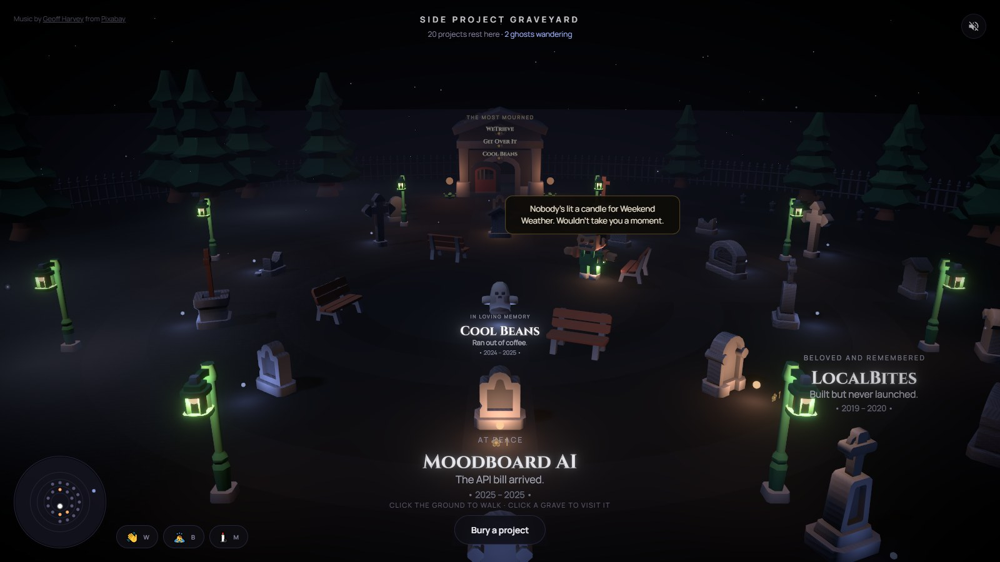
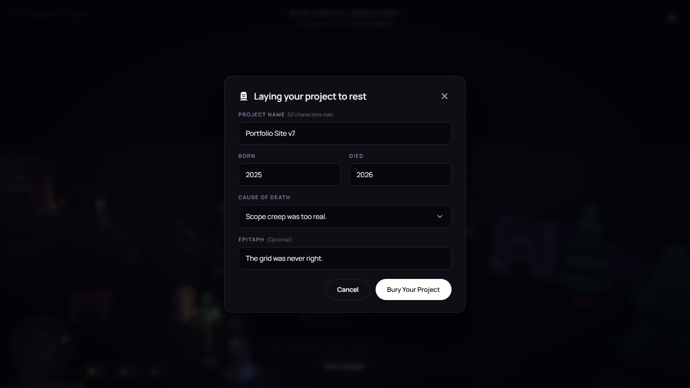

# Side Project Graveyard

A shared 3D cemetery for the side projects you never finished. Bury yours, and watch strangers mourn it.

**[Visit the graveyard →](https://successful-ermine-668.convex.site)**



## What it is

Everyone who makes things has a folder of abandoned work. Side Project Graveyard takes that private, slightly embarrassing pile and makes it public, communal and funny.

Bury a project — its name, the years it lived, and how it died — and it becomes a headstone at a real plot in a world anyone can walk through. Other visitors are there with you, live, as ghosts. No sign-up, no install: open the link and you're standing in the graveyard.

## What you can do

- **Bury a project.** Choose from 27 causes of death across six categories, from *"Scope creep was too real."* to *"Vibe coded too close to the sun."* Add an epitaph if the death deserves one.
- **Visit a grave.** Read its epitaph, leave a flower, or relight its candle.
- **Keep the candles burning.** Every candle goes out after 24 hours. How lit the graveyard looks is a live measure of whether anyone still visits.
- **Walk with other ghosts.** See everyone who's online moving between the graves, and wave, bow or mourn at them.
- **Meet the caretaker.** He walks over and tells you which grave has gone dark, or which is the most mourned.
- **Find the mausoleum.** It honours the three most-mourned projects in the yard.
- **Share a grave.** Every headstone has its own link that drops anyone who opens it right at the grave.



## How it's built

React 19, Vite, React Three Fiber and drei for the 3D scene, on [Convex](https://convex.dev) for the database, realtime sync and hosting.

A few decisions worth calling out:

- **Realtime without a game server.** Movement is stored as a single destination per click, not a stream of positions. Every client replays the same walk from the same timestamp, so ghosts move smoothly without the database being written to on every frame.
- **Burials that can't collide.** A grave's plot is claimed inside one database transaction, and its position is derived from that plot number. Two people burying at the same instant can never land in the same spot.
- **A graveyard that grows.** The fence, treeline, lanterns, mausoleum and walkable area are all derived from how many graves exist, so the yard expands as it fills rather than running out of room.
- **Recolouring a shared palette.** Every model shares a single colour texture. Instead of editing it — which would repaint everything — individual models are recoloured by pointing their UVs at different swatches.
- **Nothing loads from a CDN.** Fonts, models and audio are all self-hosted, so nothing can fail to load mid-visit.

## Run it locally

You'll need Node.js and a free [Convex](https://convex.dev) account.

```bash
npm install
npx convex dev     # links a Convex project and writes .env.local
npm run dev        # in a second terminal
```

## Built for Burning Token 2026

Made during the Burning Token hackathon and entered in two challenges: **Fun Build** (NERDCONF) and **Multiplayer** (Convex). The day-by-day record of what was built, and when, is in [CHANGELOG.md](CHANGELOG.md).

Designed and built by Kris Shogren ([@CMYKrisCC](https://github.com/CMYKrisCC)), with Claude Code as a pair programmer.

## Credits

- **3D models:** [Graveyard Kit](https://kenney.nl) by Kenney — CC0.
- **Fonts:** Cinzel and Manrope — SIL Open Font License. License texts are in [`public/fonts`](public/fonts).
- **Music:** "Spirits of the Moor" by [Geoff Harvey](https://pixabay.com/users/geoffharvey-9096471/) from [Pixabay](https://pixabay.com/music/).
